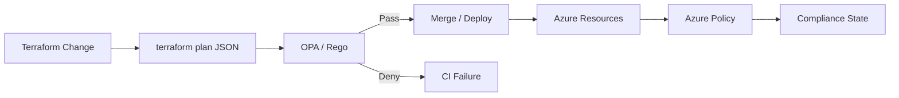

# Azure Policy + OPA/Rego Governance

[](https://github.com/ugochuk/azure-policy-opa-governance/actions/workflows/policy-ci.yml)

Policy-as-Code portfolio project demonstrating how Azure Policy and Open Policy Agent (OPA/Rego) can be used together to enforce cloud governance before and after infrastructure deployment.

## What this project demonstrates

- OPA/Rego policy development
- Terraform plan evaluation before deployment
- Azure Policy definitions and assignments
- Preventive and detective cloud governance
- CI-based policy testing
- Security requirements for tags, public access, encryption, and network exposure
- Separation of platform policy from workload code
- Automated policy unit tests

## Governance model



OPA provides a pre-deployment policy gate against the Terraform plan. Azure Policy provides platform-native governance and compliance after resources exist in Azure.

## Repository structure

```text
.
├── .github/workflows/
│   └── policy-ci.yml
├── azure-policy/
│   ├── allowed-locations.json
│   └── require-environment-tag.json
├── examples/
│   ├── compliant-plan.json
│   └── noncompliant-plan.json
├── policies/
│   ├── deny_public_storage.rego
│   ├── require_environment_tag.rego
│   └── require_tls12.rego
├── tests/
│   ├── deny_public_storage_test.rego
│   ├── require_environment_tag_test.rego
│   └── require_tls12_test.rego
├── terraform/
│   ├── main.tf
│   ├── providers.tf
│   └── versions.tf
└── README.md
```

## Policy examples

The Rego policies in this project inspect Terraform plan JSON and deny changes that violate selected controls. Examples include:

- Storage accounts with public blob access enabled
- Storage accounts that do not enforce TLS 1.2
- Resources missing the `Environment` tag

Azure Policy examples demonstrate equivalent or complementary runtime controls.

## Local testing

Install OPA, then run:

```bash
opa test policies tests -v
```

Evaluate a sample Terraform plan:

```bash
opa eval \
  --data policies \
  --input examples/noncompliant-plan.json \
  'data.azure.governance.deny'
```

## Why combine OPA and Azure Policy?

OPA can evaluate proposed infrastructure before deployment and provides fast feedback inside CI/CD. Azure Policy is authoritative within Azure and continuously evaluates deployed resources. Used together, they provide defense in depth: shift-left prevention plus platform-level enforcement and compliance visibility.

## Portfolio note

This is an original portfolio implementation and contains no proprietary employer policy code, tenant IDs, subscription IDs, customer data, or internal standards.
