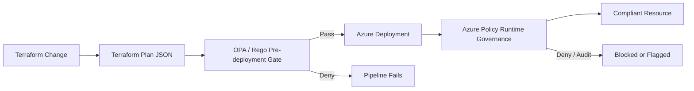

# Governance Model

## Two layers of enforcement

This project uses two complementary policy layers.

## OPA/Rego: shift-left governance

OPA evaluates the Terraform plan before Azure resources are changed. This gives engineers fast feedback during pull requests and prevents known-bad infrastructure configurations from progressing through CI/CD.

Example controls include:

- Required Environment tagging
- TLS 1.2 enforcement on Storage Accounts
- Prevention of anonymous blob access
- Prevention of public Storage Account network exposure
- Key Vault public-access restrictions
- Key Vault RBAC requirement
- Key Vault purge protection
- Prevention of unrestricted SSH/RDP rules

## Azure Policy: runtime governance

Azure Policy provides enforcement at the Azure control plane. This protects the environment even when a resource is created outside the primary Terraform pipeline.

The included custom policy requires the `Environment` tag and uses a deny effect.

## Why both?

OPA and Azure Policy solve related but different problems. OPA provides developer feedback before deployment and can evaluate Terraform-specific context. Azure Policy provides centralized Azure-native enforcement regardless of the deployment path.

Using both creates defense in depth:

1. Catch violations during development.
2. Block violations in CI/CD.
3. Enforce organizational requirements at the cloud platform boundary.
4. Produce compliance information after deployment.

## Enterprise extension points

A larger implementation could add policy bundles, exception metadata with expiration dates, management-group Azure Policy initiatives, compliance reporting, Defender for Cloud mappings, pull-request annotations, policy ownership metadata, and automated testing for every control.
